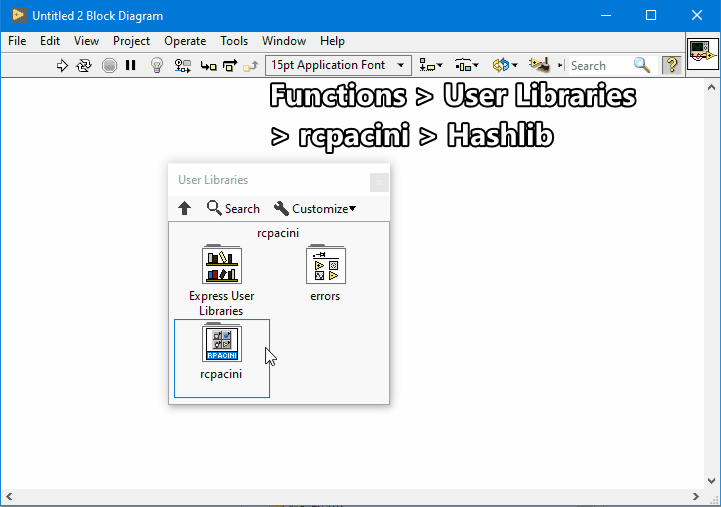

# labview_hashlib
Secure hash and message digest algorithms writen in plain LabVIEW designed primarily for web application authentication.

LabVIEW library includes: SHA-256, SCRAM-SHA-256, PBKDF2-SHA-256, HMAC-SHA-256 and Base64 encoding/decoding.

## Releases
To install, download and run the VI Package (\*.vip) using the VI Package Manager which is installed with LabVIEW.

| VI Package | Version | LabVIEW | Source Zip |
| --- | --- | --- | --- |
| [rcpacini_hashlib-0.1.0.4.vip](https://github.com/rcpacini/labview_hashlib/raw/master/releases/rcpacini_hashlib-0.1.0.4.vip) | 0.1.0.4 | LV2019 | [rcpacini_hashlib-0.1.0.4.zip](https://github.com/rcpacini/labview_hashlib/raw/master/releases/rcpacini_hashlib-0.1.0.4.zip) |

This VI Package installs to the `<LABVIEW>\user.lib\_rcpacini\hashlib` directory and is available on the diagram palette `Functions > User Libraries > rcpacini > Hashlib`.

## Example
Once the VI Package is installed, open the example VI located at `<LABVIEW>\examples\rcpacini\hashlib\hashlib_example.vit`.

## Algorithms
- **SCRAM-SHA-256** - [RFC 5802](https://tools.ietf.org/html/rfc5802) Secure authentication mechanism (client first and final messages)
- **PBKDF2-SHA-256** - [RFC 2898C](https://tools.ietf.org/html/rfc2898) Salted password-based cryptography
- **HMAC-SHA-256** - [RFC 2104](https://tools.ietf.org/html/rfc2104) Keyed hashing
- **SHA-256** - [RFC 4634](https://tools.ietf.org/html/rfc4634) 256 bit hash
- **Base64** - [RFC 4648](https://tools.ietf.org/html/rfc4648) Encode/decode

Refer to the specifications at `https://tools.ietf.org/html/rfcXXXX` .

## Acronyms & Abbreviations
| Key | Name |
| --- | --- |
| **SCRAM** | Salted Challenge Response Authentication Mechanism |
| **HMAC** | Keyed-Hashing for Message Authentication |
| **PBKDF2** | Password-Based Cryptography Specification Version 2.0 |
| **SHA** | Secure Hash Algorithm |

## Development
The following sections are instructions on how to rebuild and test this package.

### Build
To rebuild the Source Zip, open the `hashlib\hashlib.lvproj` (LabVIEW Project), navigate to the `Build Specifications > Hashlib Source` properties, under `Zip Information` update the **Destination** filename version and press **Build**.

The Source Zip is output to `releases/rcpacini_hashlib-X.X.X.X.zip`

To rebuild the VI Package, open the `hashlib\hashlib.vipb` (VI Package Build) in VI Package Manager, update the version information and press Build.

The VI Package is output to `releases/rcpacini_hashlib-X.X.X.X.vip`

### Test
Once the VI Package is installed to `Functions > User Libraries > rcpacini > Hashlib`, open the `tests\test_hashlib.lvproj` and run the `test_all.vi`.
If successful, the **all_passed** boolean should return True.

## Support
Submit a ticket for bug fixes or feature requests.

-Ryan
